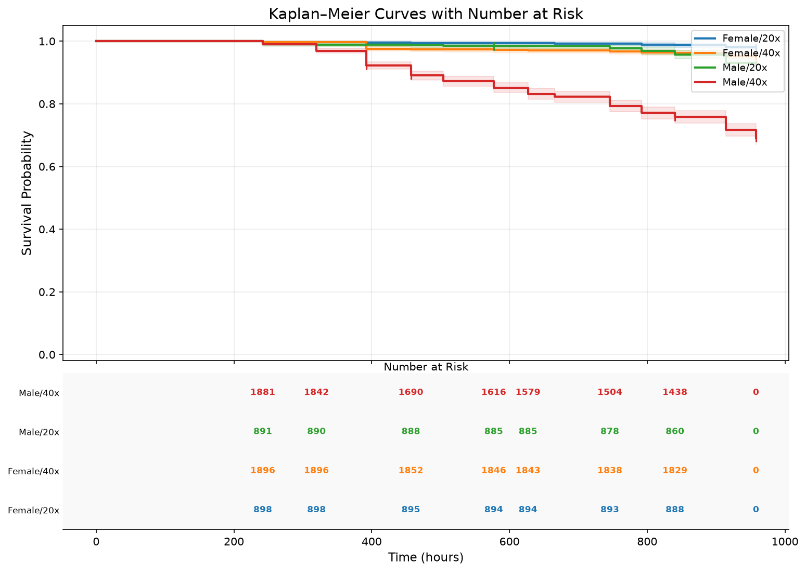
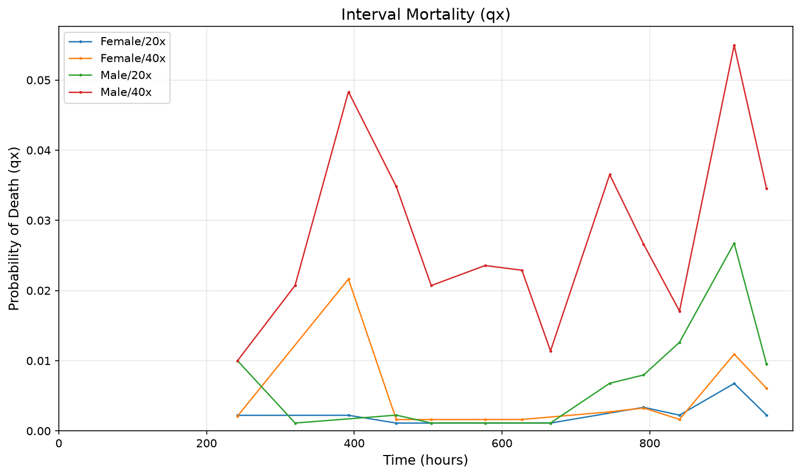
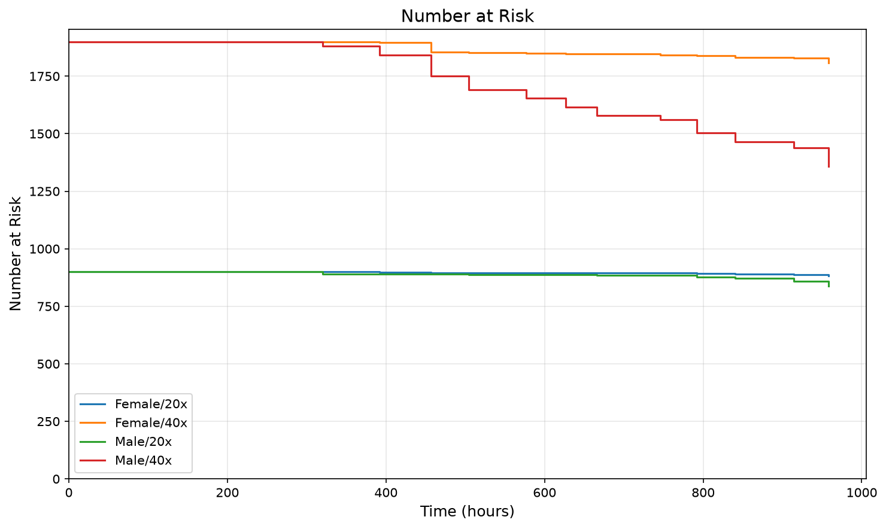
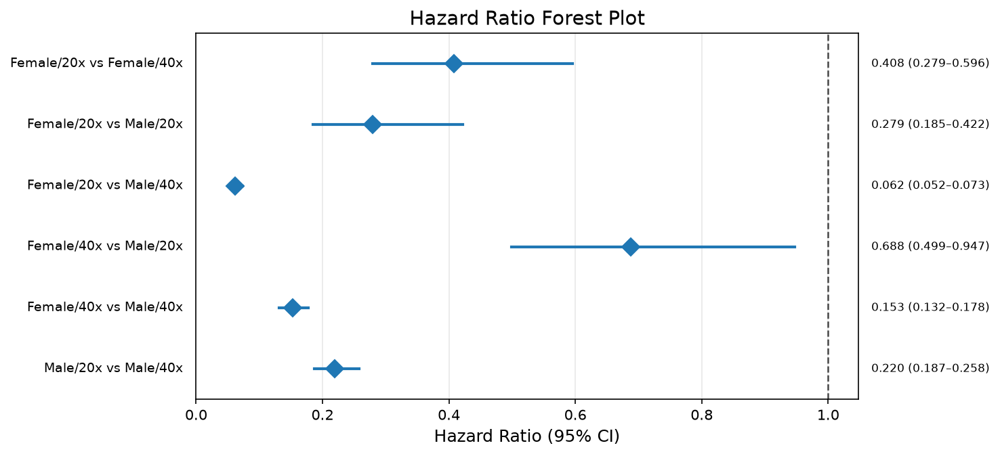

# DataSet1 — Survival Analysis

*Survivorship of a census-scored lifespan cohort. Curves are Kaplan-Meier estimates over individuals; individuals unaccounted for at the final census are right-censored unless that policy is switched off in the experiment's configuration.*

- **Experiment type:** Standard Lifespan
- **Data file:** DataSet1.xlsx
- **Generated:** 2026-08-23 12:43
- **Factors:** Sex, Density
- **Treatments:** 4
- **Individuals:** 5600
- **Deaths:** 777
- **Censored:** 4823 (86.1%)
- **Exclusion group:** none
- **Censoring policy:** unaccounted individuals censored

> ✅ Omnibus log-rank: treatments differ (p = <0.0001).

## Experiment summary

**Per-treatment summary**

| treatment | n_individuals | n_deaths | n_censored | pct_censored |
|---|---|---|---|---|
| Female/20x | 900 | 20 | 880 | 97.800 |
| Female/40x | 1900 | 102 | 1798 | 94.600 |
| Male/20x | 900 | 70 | 830 | 92.200 |
| Male/40x | 1900 | 585 | 1315 | 69.200 |

Observation window 241.94–958.05, 200 chamber(s).

## Survivorship figures

### KM curves with at-risk table — headline figure

*Survivorship with the number at risk beneath the axis.*

### Kaplan-Meier curves

*Survivorship by treatment.*

### Lifespan distribution

*Distribution of individual lifespans by treatment.*

### Mortality (qx)

*Interval mortality probability.*

### Smoothed hazard

*Kernel-smoothed hazard rate.*

### Nelson-Aalen cumulative hazard

*Cumulative hazard by treatment.*

### Number at risk

*Individuals at risk over time.*

### Hazard-ratio forest

*Pairwise hazard ratios with 95% confidence intervals.*

### Log-log diagnostic

*Parallel lines support the proportional-hazards assumption.*

## Lifespan statistics

**Median survival**

| treatment | median_survival |
|---|---|
| Female/20x | — |
| Female/40x | — |
| Male/20x | — |
| Male/40x | — |

**Mean survival**

| treatment | rmst | restriction_time |
|---|---|---|
| Female/20x | 951.565 | 958.054 |
| Female/40x | 937.129 | 958.054 |
| Male/20x | 939.142 | 958.054 |
| Male/40x | 845.827 | 958.054 |

**Lifespan statistics by treatment**

| group | n | n_deaths | n_censored | mean_rmst | median | t_max |
|---|---|---|---|---|---|---|
| Female/20x | 900 | 20 | 880 | 951.570 | — | 958.050 |
| Female/40x | 1900 | 102 | 1798 | 937.130 | — | 958.050 |
| Male/20x | 900 | 70 | 830 | 939.140 | — | 958.050 |
| Male/40x | 1900 | 585 | 1315 | 845.830 | — | 958.050 |

**Lifespan statistics by factor level**

| group | n | n_deaths | n_censored | mean_rmst | median | t_max |
|---|---|---|---|---|---|---|
| Sex=Female | 2800 | 122 | 2678 | 941.870 | — | 958.050 |
| Sex=Male | 2800 | 655 | 2145 | 875.860 | — | 958.050 |
| Density=20x | 1800 | 90 | 1710 | 945.530 | — | 958.050 |
| Density=40x | 3800 | 687 | 3113 | 891.940 | — | 958.050 |

**Survival quantiles**

| treatment | S=90% | S=75% | S=50% | S=25% | S=10% |
|---|---|---|---|---|---|
| Female/20x | — | — | — | — | — |
| Female/40x | — | — | — | — | — |
| Male/20x | — | — | — | — | — |
| Male/40x | 456.929 | 914.349 | — | — | — |

## Survival comparisons

**Overall comparison**

| Test | chi² | df | p |  |
|---|---|---|---|---|
| Omnibus log-rank | 740.82 | 3 | <0.0001 | *** |

**Pairwise log-rank**

| group1 | group2 | observed_1 | expected_1 | chi2 | p_value | df | p_bonferroni | significant_0.05 |
|---|---|---|---|---|---|---|---|---|
| ✅ Female/20x | Female/40x | 20.000 | 39.606 | 14.491 | 0.000 | 1 | 0.001 | True |
| ✅ Female/20x | Male/20x | 20.000 | 45.513 | 29.176 | 0.000 | 1 | 0.000 | True |
| ✅ Female/20x | Male/40x | 20.000 | 215.050 | 281.304 | 0.000 | 1 | 0.000 | True |
| ✅ Female/40x | Male/20x | 102.000 | 116.851 | 5.943 | 0.015 | 1 | 0.089 | False |
| ✅ Female/40x | Male/40x | 102.000 | 365.958 | 416.488 | 0.000 | 1 | 0.000 | True |
| ✅ Male/20x | Male/40x | 70.000 | 231.014 | 178.010 | 0.000 | 1 | 0.000 | True |

**Pairwise Gehan-Wilcoxon**

| group1 | group2 | chi2 | p_value | df | p_bonferroni | significant_0.05 |
|---|---|---|---|---|---|---|
| ✅ Female/20x | Female/40x | 14.633 | 0.000 | 1 | 0.001 | True |
| ✅ Female/20x | Male/20x | 29.099 | 0.000 | 1 | 0.000 | True |
| ✅ Female/20x | Male/40x | 279.819 | 0.000 | 1 | 0.000 | True |
| ✅ Female/40x | Male/20x | 5.629 | 0.018 | 1 | 0.106 | False |
| ✅ Female/40x | Male/40x | 410.245 | 0.000 | 1 | 0.000 | True |
| ✅ Male/20x | Male/40x | 181.411 | 0.000 | 1 | 0.000 | True |

**Pairwise hazard ratios**

| group1 | group2 | hazard_ratio | hr_ci_lo | hr_ci_hi |
|---|---|---|---|---|
| Female/20x | Female/40x | 0.408 | 0.279 | 0.596 |
| Female/20x | Male/20x | 0.279 | 0.185 | 0.422 |
| Female/20x | Male/40x | 0.062 | 0.052 | 0.073 |
| Female/40x | Male/20x | 0.688 | 0.499 | 0.947 |
| Female/40x | Male/40x | 0.153 | 0.132 | 0.178 |
| Male/20x | Male/40x | 0.220 | 0.187 | 0.258 |

## Data quality

No chambers were excluded from this analysis.

**Parametric model fits**

| Parametric model | AIC |
|---|---|
| results_by_treatment | — |
| aic_comparison |      treatment         model       aic  log_likelihood  median_survival
0   Female/20x       Weibull    455.91       -225.9531          3391.31
1   Female/20x    Log-Normal    457.19       -226.5957          8071.94
2   Female/20x  Log-Logistic    455.97       -225.9848          3836.51
3   Female/40x       Weibull   2163.49      -1079.7466          3493.18
4   Female/40x    Log-Normal   2159.37      -1077.6827          6607.40
5   Female/40x  Log-Logistic   2163.44      -1079.7209          4091.07
6     Male/20x       Weibull   1391.35       -693.6738          1858.02
7     Male/20x    Log-Normal   1404.55       -700.2753          3095.00
8     Male/20x  Log-Logistic   1392.58       -694.2907          2040.04
9     Male/40x       Weibull  10135.97      -5065.9874          1270.19
10    Male/40x    Log-Normal  10100.90      -5048.4521          1395.00
11    Male/40x  Log-Logistic  10130.01      -5063.0069          1334.77 |
| best_model_per_treatment | — |
