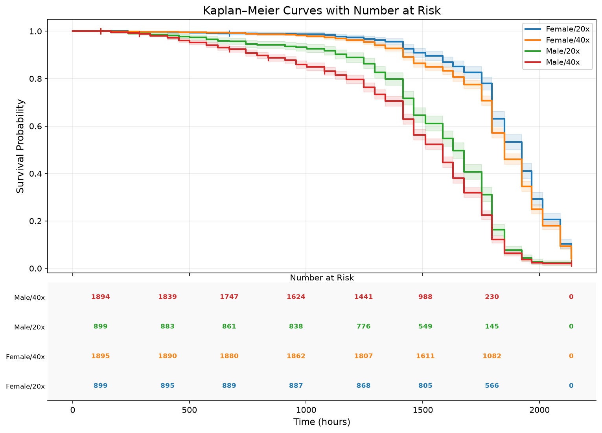
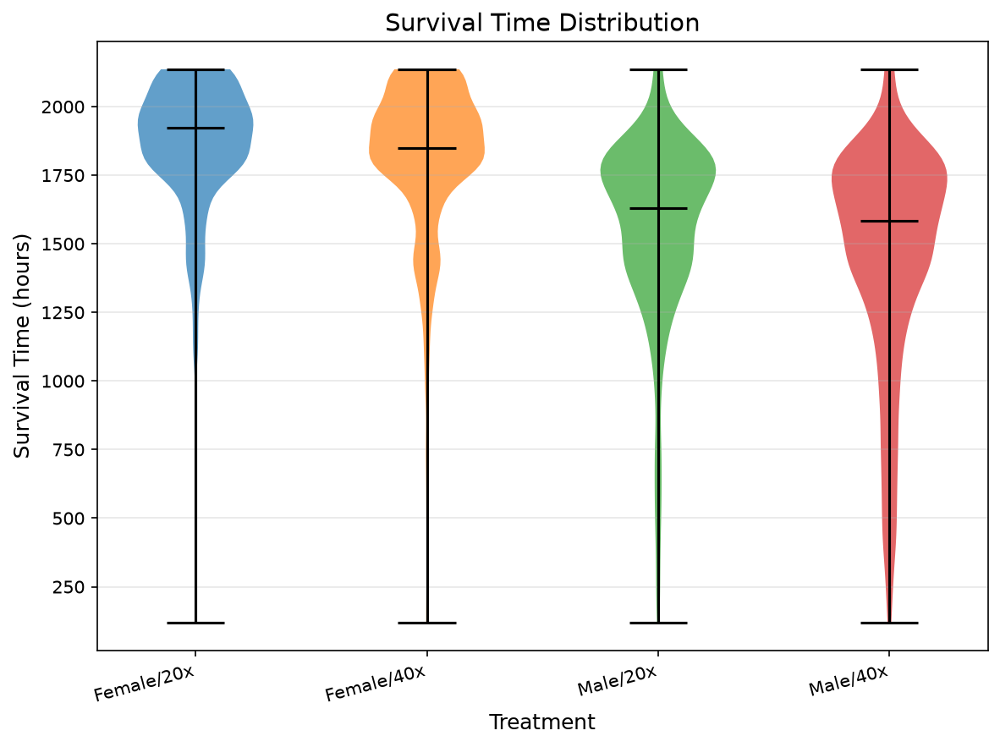
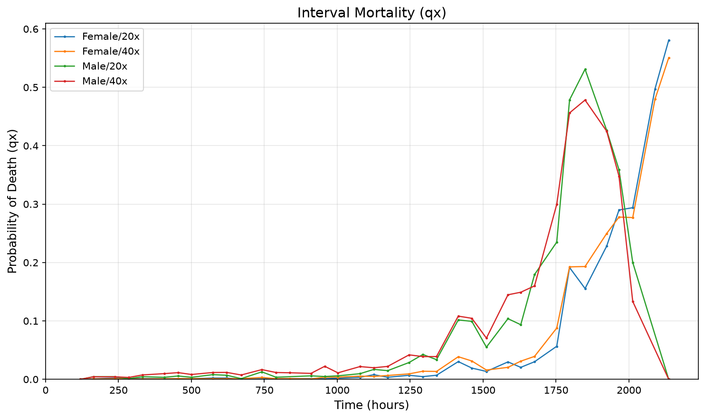
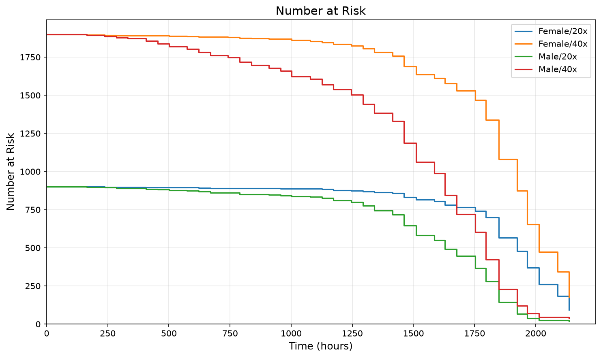
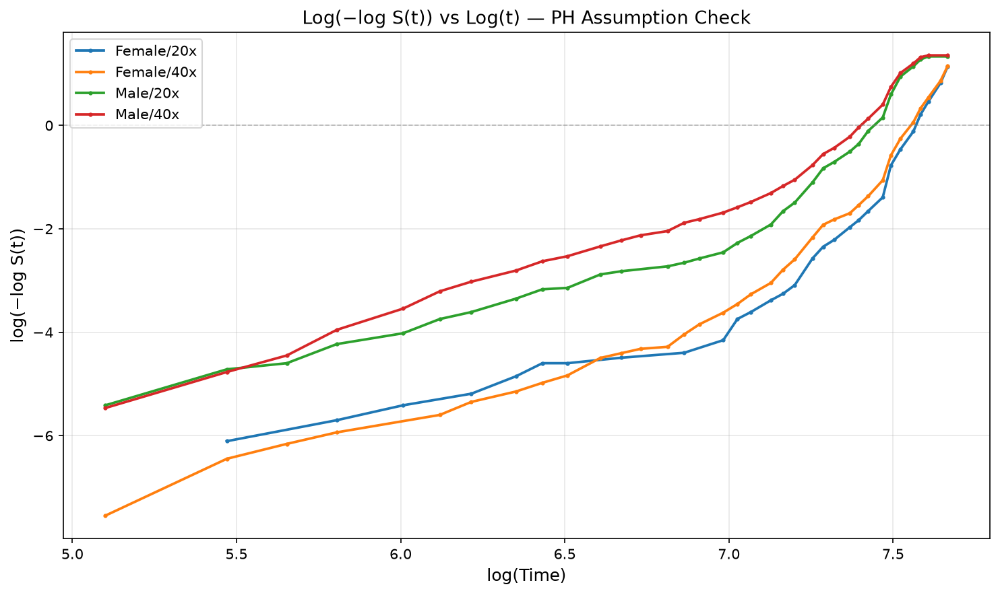

# DataSet2 — Survival Analysis

*Survivorship of a census-scored lifespan cohort. Curves are Kaplan-Meier estimates over individuals; individuals unaccounted for at the final census are right-censored unless that policy is switched off in the experiment's configuration.*

- **Experiment type:** Standard Lifespan
- **Data file:** DataSet2.xlsx
- **Generated:** 2026-08-27 21:38
- **Factors:** Sex, Density
- **Treatments:** 4
- **Individuals:** 5600
- **Deaths:** 5402
- **Censored:** 198 (3.5%)
- **Exclusion group:** none
- **Censoring policy:** unaccounted individuals censored

> ✅ Omnibus log-rank: treatments differ (p = <0.0001).

## Experiment summary

**Per-treatment summary**

| treatment | n_individuals | n_deaths | n_censored | pct_censored |
|---|---|---|---|---|
| Female/20x | 900 | 859 | 41 | 4.600 |
| Female/40x | 1900 | 1815 | 85 | 4.500 |
| Male/20x | 900 | 878 | 22 | 2.400 |
| Male/40x | 1900 | 1850 | 50 | 2.600 |

Observation window 119.62–2136.14, 200 chamber(s).

## Survivorship figures

### KM curves with at-risk table — headline figure

*Survivorship with the number at risk beneath the axis.*

### Kaplan-Meier curves

*Survivorship by treatment.*

### Lifespan distribution

*Distribution of individual lifespans by treatment.*

### Mortality (qx)

*Interval mortality probability.*

### Smoothed hazard

*Kernel-smoothed hazard rate.*

### Nelson-Aalen cumulative hazard

*Cumulative hazard by treatment.*

### Number at risk

*Individuals at risk over time.*

### Hazard-ratio forest

*Pairwise hazard ratios with 95% confidence intervals.*

### Log-log diagnostic

*Parallel lines support the proportional-hazards assumption.*

## Lifespan statistics

**Median survival**

| treatment | median_survival |
|---|---|
| Female/20x | 1923.479 |
| Female/40x | 1849.431 |
| Male/20x | 1628.977 |
| Male/40x | 1585.109 |

**Mean survival**

| treatment | rmst | restriction_time |
|---|---|---|
| Female/20x | 1825.136 | 2136.138 |
| Female/40x | 1785.516 | 2136.138 |
| Male/20x | 1529.745 | 2136.138 |
| Male/40x | 1431.423 | 2136.138 |

**Lifespan statistics by treatment**

| group | n | n_deaths | n_censored | mean_rmst | median | t_max |
|---|---|---|---|---|---|---|
| Female/20x | 900 | 859 | 41 | 1825.140 | 1923.480 | 2136.140 |
| Female/40x | 1900 | 1815 | 85 | 1785.520 | 1849.430 | 2136.140 |
| Male/20x | 900 | 878 | 22 | 1529.740 | 1628.980 | 2136.140 |
| Male/40x | 1900 | 1850 | 50 | 1431.420 | 1585.110 | 2136.140 |

**Lifespan statistics by factor level**

| group | n | n_deaths | n_censored | mean_rmst | median | t_max |
|---|---|---|---|---|---|---|
| Sex=Female | 2800 | 2674 | 126 | 1798.370 | 1849.430 | 2136.140 |
| Sex=Male | 2800 | 2728 | 72 | 1463.150 | 1585.110 | 2136.140 |
| Density=20x | 1800 | 1737 | 63 | 1677.540 | 1796.280 | 2136.140 |
| Density=40x | 3800 | 3665 | 135 | 1608.720 | 1752.370 | 2136.140 |

**Survival quantiles**

| treatment | S=90% | S=75% | S=50% | S=25% | S=10% |
|---|---|---|---|---|---|
| Female/20x | 1511.224 | 1796.282 | 1923.479 | 2012.853 | 2136.138 |
| Female/40x | 1414.742 | 1752.370 | 1849.431 | 1965.732 | 2089.093 |
| Male/20x | 1172.736 | 1414.742 | 1628.977 | 1796.282 | 1849.431 |
| Male/40x | 789.977 | 1293.467 | 1585.109 | 1752.370 | 1849.431 |

## Survival comparisons

**Overall comparison**

| Test | chi² | df | p |  |
|---|---|---|---|---|
| Omnibus log-rank | 1554.87 | 3 | <0.0001 | *** |

**Pairwise log-rank**

| group1 | group2 | observed_1 | expected_1 | chi2 | p_value | df | p_bonferroni | significant_0.05 |
|---|---|---|---|---|---|---|---|---|
| ✅ Female/20x | Female/40x | 859.000 | 921.307 | 8.241 | 0.004 | 1 | 0.025 | True |
| ✅ Female/20x | Male/20x | 859.000 | 1231.094 | 498.050 | 0.000 | 1 | 0.000 | True |
| ✅ Female/20x | Male/40x | 859.000 | 1477.824 | 752.562 | 0.000 | 1 | 0.000 | True |
| ✅ Female/40x | Male/20x | 1815.000 | 2230.979 | 554.198 | 0.000 | 1 | 0.000 | True |
| ✅ Female/40x | Male/40x | 1815.000 | 2600.681 | 1025.915 | 0.000 | 1 | 0.000 | True |
| ✅ Male/20x | Male/40x | 878.000 | 989.550 | 24.441 | 0.000 | 1 | 0.000 | True |

**Pairwise Gehan-Wilcoxon**

| group1 | group2 | chi2 | p_value | df | p_bonferroni | significant_0.05 |
|---|---|---|---|---|---|---|
| ✅ Female/20x | Female/40x | 14.331 | 0.000 | 1 | 0.001 | True |
| ✅ Female/20x | Male/20x | 523.649 | 0.000 | 1 | 0.000 | True |
| ✅ Female/20x | Male/40x | 764.381 | 0.000 | 1 | 0.000 | True |
| ✅ Female/40x | Male/20x | 585.387 | 0.000 | 1 | 0.000 | True |
| ✅ Female/40x | Male/40x | 1082.786 | 0.000 | 1 | 0.000 | True |
| ✅ Male/20x | Male/40x | 36.552 | 0.000 | 1 | 0.000 | True |

**Pairwise hazard ratios**

| group1 | group2 | hazard_ratio | hr_ci_lo | hr_ci_hi |
|---|---|---|---|---|
| Female/20x | Female/40x | 0.900 | 0.831 | 0.975 |
| Female/20x | Male/20x | 0.402 | 0.362 | 0.446 |
| Female/20x | Male/40x | 0.387 | 0.359 | 0.417 |
| Female/40x | Male/20x | 0.428 | 0.387 | 0.473 |
| Female/40x | Male/40x | 0.402 | 0.374 | 0.431 |
| Male/20x | Male/40x | 0.834 | 0.771 | 0.901 |

## Data quality

No chambers were excluded from this analysis.

**Parametric model fits**

| Parametric model | AIC |
|---|---|
| results_by_treatment | — |
| aic_comparison |      treatment         model       aic  log_likelihood  median_survival
0   Female/20x       Weibull  11940.51      -5968.2568          1880.65
1   Female/20x    Log-Normal  12692.05      -6344.0231          1834.28
2   Female/20x  Log-Logistic  12174.54      -6085.2693          1880.53
3   Female/40x       Weibull  25582.86     -12789.4291          1843.01
4   Female/40x    Log-Normal  26881.66     -13438.8292          1791.09
5   Female/40x  Log-Logistic  26069.57     -13032.7858          1841.58
6     Male/20x       Weibull  12799.89      -6397.9467          1576.51
7     Male/20x    Log-Normal  13499.81      -6747.9053          1499.72
8     Male/20x  Log-Logistic  13079.85      -6537.9233          1583.95
9     Male/40x       Weibull  27612.22     -13804.1099          1473.14
10    Male/40x    Log-Normal  28739.29     -14367.6425          1378.18
11    Male/40x  Log-Logistic  28244.27     -14120.1364          1479.89 |
| best_model_per_treatment | — |
