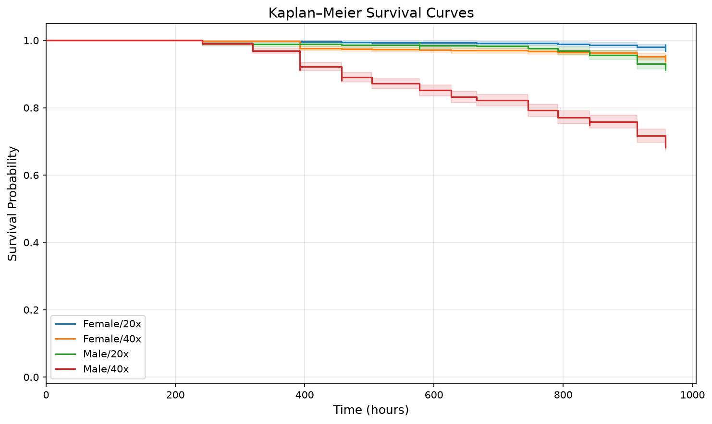
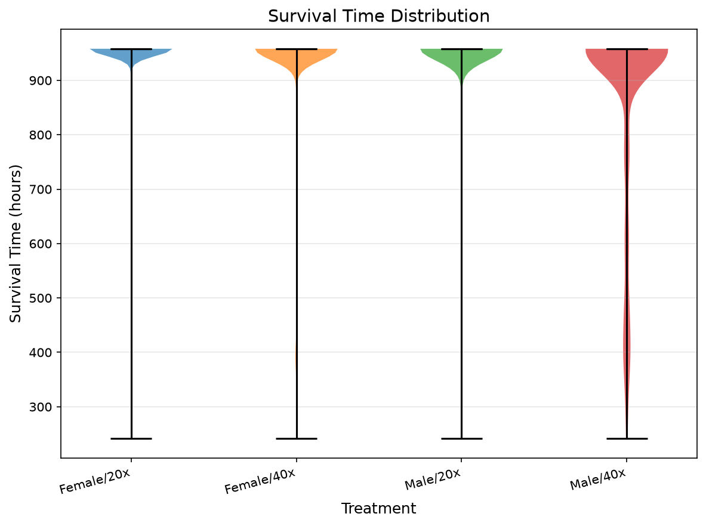
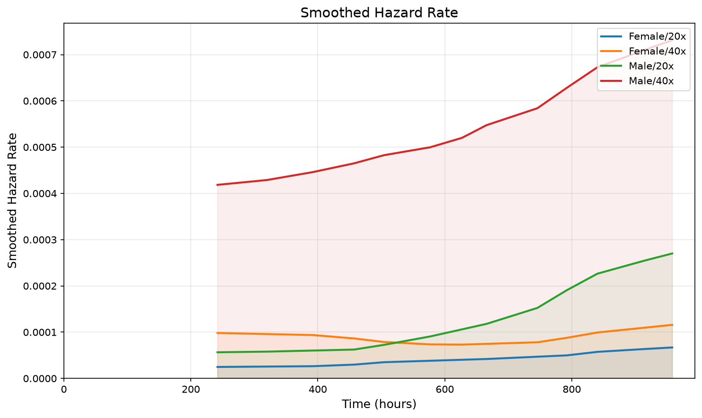
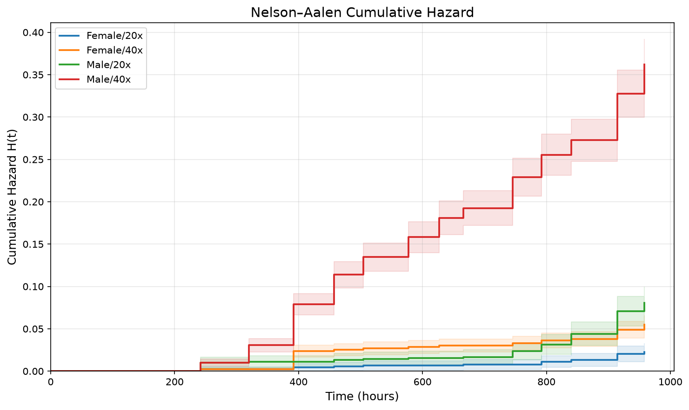
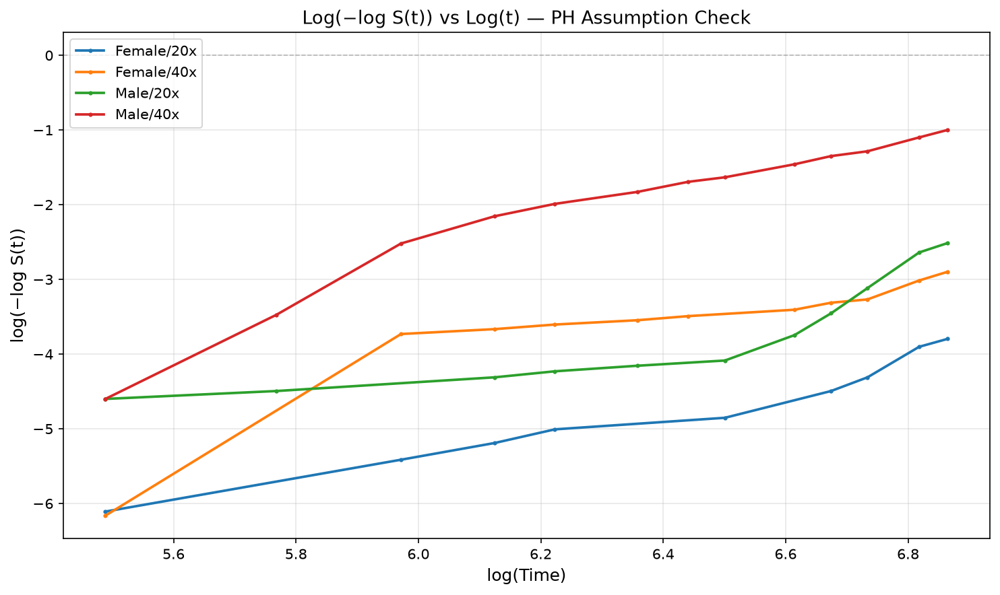
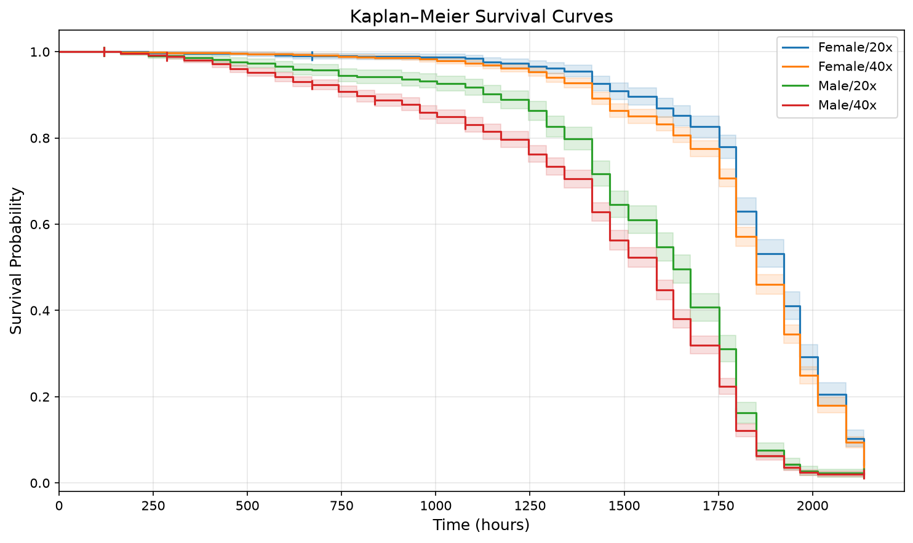
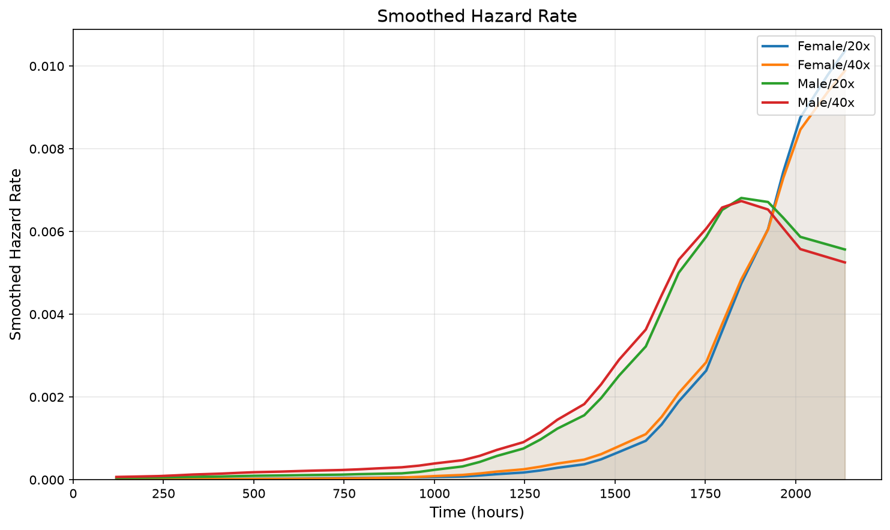
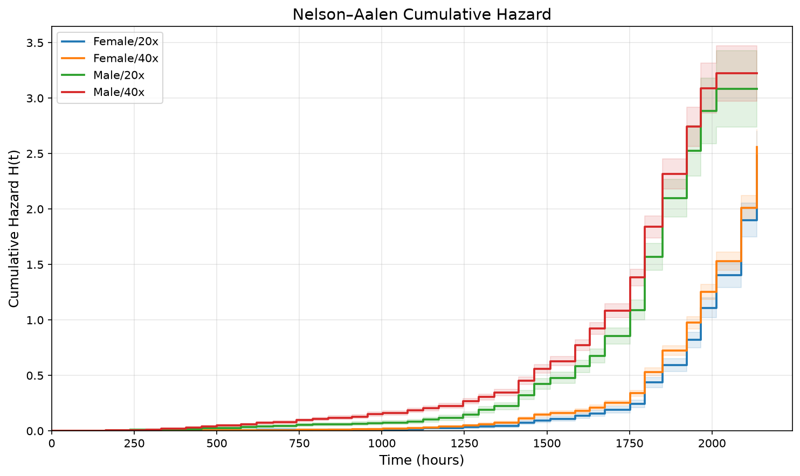
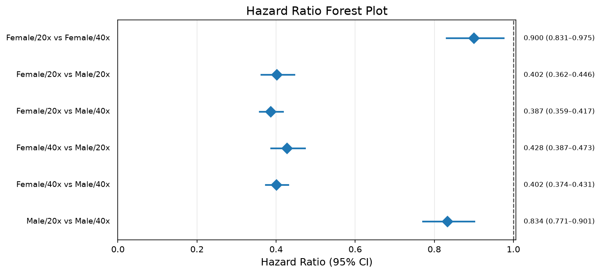

# TestProject — Project Report

*Whether dilps block crowding effects on lifespan.*

- **Experiment type:** Standard Lifespan
- **Members:** 2
- **Generated:** 2026-08-27 21:38
- **Path:** /home/scott/GithubLocal/pySurvAnalysis/TestProject

> ✅ 2 of 2 member experiment(s) analysed.

## Members

**Member inventory**

| Member | Analysed | N | Deaths | Censored | Treatments | Factors | Exclusion group |
|---|---|---|---|---|---|---|---|
| DataSet1 | 2026-08-23T12:43:26 | 5600 | 777 | 4823 (86.1%) | 4 | Sex, Density | none |
| DataSet2 | 2026-08-27T21:38:44 | 5600 | 5402 | 198 (3.5%) | 4 | Sex, Density | none |

*Each member is analysed independently; nothing here is pooled.*

No divergence detected between members: they declare the same factors, levels, censoring policy and exclusion group.

---

## DataSet1

Standard Lifespan

### Experiment summary

**Per-treatment summary**

| treatment | n_individuals | n_deaths | n_censored | pct_censored |
|---|---|---|---|---|
| Female/20x | 900 | 20 | 880 | 97.800 |
| Female/40x | 1900 | 102 | 1798 | 94.600 |
| Male/20x | 900 | 70 | 830 | 92.200 |
| Male/40x | 1900 | 585 | 1315 | 69.200 |

Observation window 241.94–958.05, 200 chamber(s).

### Survivorship figures

### KM curves with at-risk table — headline figure

*Survivorship with the number at risk beneath the axis.*

### Kaplan-Meier curves

*Survivorship by treatment.*

### Lifespan distribution

*Distribution of individual lifespans by treatment.*

### Mortality (qx)

*Interval mortality probability.*

### Smoothed hazard

*Kernel-smoothed hazard rate.*

### Nelson-Aalen cumulative hazard

*Cumulative hazard by treatment.*

### Number at risk

*Individuals at risk over time.*

### Hazard-ratio forest

*Pairwise hazard ratios with 95% confidence intervals.*

### Log-log diagnostic

*Parallel lines support the proportional-hazards assumption.*

### Lifespan statistics

**Median survival**

| treatment | median_survival |
|---|---|
| Female/20x | — |
| Female/40x | — |
| Male/20x | — |
| Male/40x | — |

**Mean survival**

| treatment | rmst | restriction_time |
|---|---|---|
| Female/20x | 951.565 | 958.054 |
| Female/40x | 937.129 | 958.054 |
| Male/20x | 939.142 | 958.054 |
| Male/40x | 845.827 | 958.054 |

**Lifespan statistics by treatment**

| group | n | n_deaths | n_censored | mean_rmst | median | t_max |
|---|---|---|---|---|---|---|
| Female/20x | 900 | 20 | 880 | 951.570 | — | 958.050 |
| Female/40x | 1900 | 102 | 1798 | 937.130 | — | 958.050 |
| Male/20x | 900 | 70 | 830 | 939.140 | — | 958.050 |
| Male/40x | 1900 | 585 | 1315 | 845.830 | — | 958.050 |

**Lifespan statistics by factor level**

| group | n | n_deaths | n_censored | mean_rmst | median | t_max |
|---|---|---|---|---|---|---|
| Sex=Female | 2800 | 122 | 2678 | 941.870 | — | 958.050 |
| Sex=Male | 2800 | 655 | 2145 | 875.860 | — | 958.050 |
| Density=20x | 1800 | 90 | 1710 | 945.530 | — | 958.050 |
| Density=40x | 3800 | 687 | 3113 | 891.940 | — | 958.050 |

**Survival quantiles**

| treatment | S=90% | S=75% | S=50% | S=25% | S=10% |
|---|---|---|---|---|---|
| Female/20x | — | — | — | — | — |
| Female/40x | — | — | — | — | — |
| Male/20x | — | — | — | — | — |
| Male/40x | 456.929 | 914.349 | — | — | — |

### Survival comparisons

**Overall comparison**

| Test | chi² | df | p |  |
|---|---|---|---|---|
| Omnibus log-rank | 740.82 | 3 | <0.0001 | *** |

**Pairwise log-rank**

| group1 | group2 | observed_1 | expected_1 | chi2 | p_value | df | p_bonferroni | significant_0.05 |
|---|---|---|---|---|---|---|---|---|
| ✅ Female/20x | Female/40x | 20.000 | 39.606 | 14.491 | 0.000 | 1 | 0.001 | True |
| ✅ Female/20x | Male/20x | 20.000 | 45.513 | 29.176 | 0.000 | 1 | 0.000 | True |
| ✅ Female/20x | Male/40x | 20.000 | 215.050 | 281.304 | 0.000 | 1 | 0.000 | True |
| ✅ Female/40x | Male/20x | 102.000 | 116.851 | 5.943 | 0.015 | 1 | 0.089 | False |
| ✅ Female/40x | Male/40x | 102.000 | 365.958 | 416.488 | 0.000 | 1 | 0.000 | True |
| ✅ Male/20x | Male/40x | 70.000 | 231.014 | 178.010 | 0.000 | 1 | 0.000 | True |

**Pairwise Gehan-Wilcoxon**

| group1 | group2 | chi2 | p_value | df | p_bonferroni | significant_0.05 |
|---|---|---|---|---|---|---|
| ✅ Female/20x | Female/40x | 14.633 | 0.000 | 1 | 0.001 | True |
| ✅ Female/20x | Male/20x | 29.099 | 0.000 | 1 | 0.000 | True |
| ✅ Female/20x | Male/40x | 279.819 | 0.000 | 1 | 0.000 | True |
| ✅ Female/40x | Male/20x | 5.629 | 0.018 | 1 | 0.106 | False |
| ✅ Female/40x | Male/40x | 410.245 | 0.000 | 1 | 0.000 | True |
| ✅ Male/20x | Male/40x | 181.411 | 0.000 | 1 | 0.000 | True |

**Pairwise hazard ratios**

| group1 | group2 | hazard_ratio | hr_ci_lo | hr_ci_hi |
|---|---|---|---|---|
| Female/20x | Female/40x | 0.408 | 0.279 | 0.596 |
| Female/20x | Male/20x | 0.279 | 0.185 | 0.422 |
| Female/20x | Male/40x | 0.062 | 0.052 | 0.073 |
| Female/40x | Male/20x | 0.688 | 0.499 | 0.947 |
| Female/40x | Male/40x | 0.153 | 0.132 | 0.178 |
| Male/20x | Male/40x | 0.220 | 0.187 | 0.258 |

### Data quality

No chambers were excluded from this analysis.

---

## DataSet2

Standard Lifespan

### Experiment summary

**Per-treatment summary**

| treatment | n_individuals | n_deaths | n_censored | pct_censored |
|---|---|---|---|---|
| Female/20x | 900 | 859 | 41 | 4.600 |
| Female/40x | 1900 | 1815 | 85 | 4.500 |
| Male/20x | 900 | 878 | 22 | 2.400 |
| Male/40x | 1900 | 1850 | 50 | 2.600 |

Observation window 119.62–2136.14, 200 chamber(s).

### Survivorship figures

### KM curves with at-risk table — headline figure

*Survivorship with the number at risk beneath the axis.*

### Kaplan-Meier curves

*Survivorship by treatment.*

### Lifespan distribution

*Distribution of individual lifespans by treatment.*

### Mortality (qx)

*Interval mortality probability.*

### Smoothed hazard

*Kernel-smoothed hazard rate.*

### Nelson-Aalen cumulative hazard

*Cumulative hazard by treatment.*

### Number at risk

*Individuals at risk over time.*

### Hazard-ratio forest

*Pairwise hazard ratios with 95% confidence intervals.*

### Log-log diagnostic

*Parallel lines support the proportional-hazards assumption.*

### Lifespan statistics

**Median survival**

| treatment | median_survival |
|---|---|
| Female/20x | 1923.479 |
| Female/40x | 1849.431 |
| Male/20x | 1628.977 |
| Male/40x | 1585.109 |

**Mean survival**

| treatment | rmst | restriction_time |
|---|---|---|
| Female/20x | 1825.136 | 2136.138 |
| Female/40x | 1785.516 | 2136.138 |
| Male/20x | 1529.745 | 2136.138 |
| Male/40x | 1431.423 | 2136.138 |

**Lifespan statistics by treatment**

| group | n | n_deaths | n_censored | mean_rmst | median | t_max |
|---|---|---|---|---|---|---|
| Female/20x | 900 | 859 | 41 | 1825.140 | 1923.480 | 2136.140 |
| Female/40x | 1900 | 1815 | 85 | 1785.520 | 1849.430 | 2136.140 |
| Male/20x | 900 | 878 | 22 | 1529.740 | 1628.980 | 2136.140 |
| Male/40x | 1900 | 1850 | 50 | 1431.420 | 1585.110 | 2136.140 |

**Lifespan statistics by factor level**

| group | n | n_deaths | n_censored | mean_rmst | median | t_max |
|---|---|---|---|---|---|---|
| Sex=Female | 2800 | 2674 | 126 | 1798.370 | 1849.430 | 2136.140 |
| Sex=Male | 2800 | 2728 | 72 | 1463.150 | 1585.110 | 2136.140 |
| Density=20x | 1800 | 1737 | 63 | 1677.540 | 1796.280 | 2136.140 |
| Density=40x | 3800 | 3665 | 135 | 1608.720 | 1752.370 | 2136.140 |

**Survival quantiles**

| treatment | S=90% | S=75% | S=50% | S=25% | S=10% |
|---|---|---|---|---|---|
| Female/20x | 1511.224 | 1796.282 | 1923.479 | 2012.853 | 2136.138 |
| Female/40x | 1414.742 | 1752.370 | 1849.431 | 1965.732 | 2089.093 |
| Male/20x | 1172.736 | 1414.742 | 1628.977 | 1796.282 | 1849.431 |
| Male/40x | 789.977 | 1293.467 | 1585.109 | 1752.370 | 1849.431 |

### Survival comparisons

**Overall comparison**

| Test | chi² | df | p |  |
|---|---|---|---|---|
| Omnibus log-rank | 1554.87 | 3 | <0.0001 | *** |

**Pairwise log-rank**

| group1 | group2 | observed_1 | expected_1 | chi2 | p_value | df | p_bonferroni | significant_0.05 |
|---|---|---|---|---|---|---|---|---|
| ✅ Female/20x | Female/40x | 859.000 | 921.307 | 8.241 | 0.004 | 1 | 0.025 | True |
| ✅ Female/20x | Male/20x | 859.000 | 1231.094 | 498.050 | 0.000 | 1 | 0.000 | True |
| ✅ Female/20x | Male/40x | 859.000 | 1477.824 | 752.562 | 0.000 | 1 | 0.000 | True |
| ✅ Female/40x | Male/20x | 1815.000 | 2230.979 | 554.198 | 0.000 | 1 | 0.000 | True |
| ✅ Female/40x | Male/40x | 1815.000 | 2600.681 | 1025.915 | 0.000 | 1 | 0.000 | True |
| ✅ Male/20x | Male/40x | 878.000 | 989.550 | 24.441 | 0.000 | 1 | 0.000 | True |

**Pairwise Gehan-Wilcoxon**

| group1 | group2 | chi2 | p_value | df | p_bonferroni | significant_0.05 |
|---|---|---|---|---|---|---|
| ✅ Female/20x | Female/40x | 14.331 | 0.000 | 1 | 0.001 | True |
| ✅ Female/20x | Male/20x | 523.649 | 0.000 | 1 | 0.000 | True |
| ✅ Female/20x | Male/40x | 764.381 | 0.000 | 1 | 0.000 | True |
| ✅ Female/40x | Male/20x | 585.387 | 0.000 | 1 | 0.000 | True |
| ✅ Female/40x | Male/40x | 1082.786 | 0.000 | 1 | 0.000 | True |
| ✅ Male/20x | Male/40x | 36.552 | 0.000 | 1 | 0.000 | True |

**Pairwise hazard ratios**

| group1 | group2 | hazard_ratio | hr_ci_lo | hr_ci_hi |
|---|---|---|---|---|
| Female/20x | Female/40x | 0.900 | 0.831 | 0.975 |
| Female/20x | Male/20x | 0.402 | 0.362 | 0.446 |
| Female/20x | Male/40x | 0.387 | 0.359 | 0.417 |
| Female/40x | Male/20x | 0.428 | 0.387 | 0.473 |
| Female/40x | Male/40x | 0.402 | 0.374 | 0.431 |
| Male/20x | Male/40x | 0.834 | 0.771 | 0.901 |

### Data quality

No chambers were excluded from this analysis.
